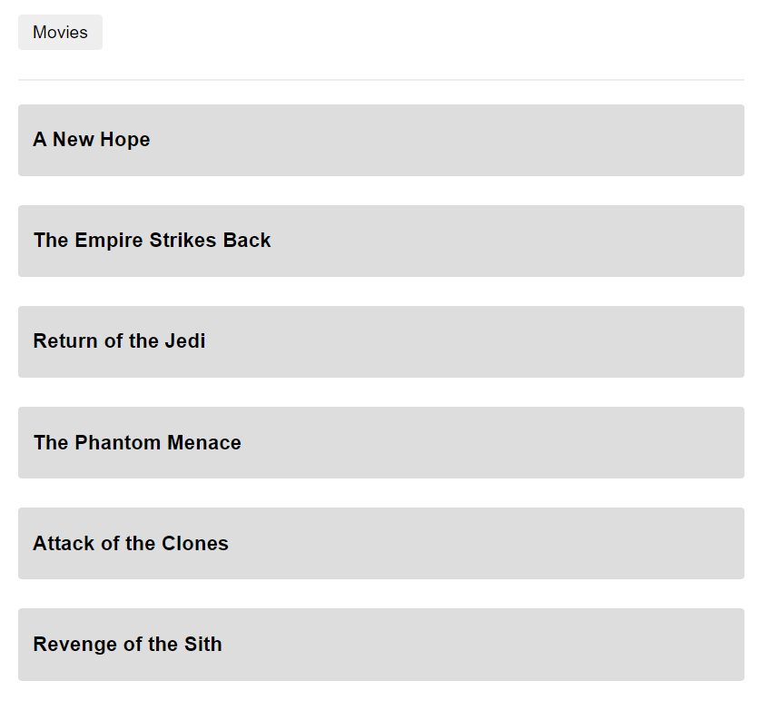
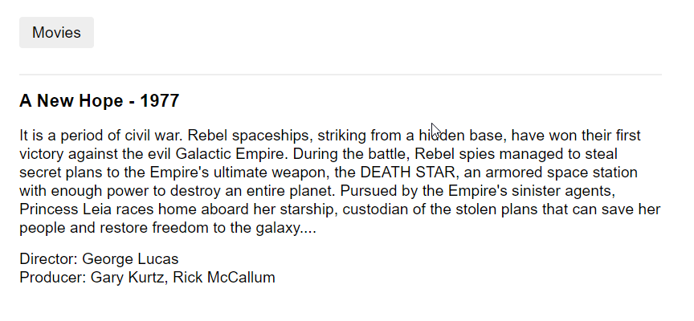

# Challenge P

## 1 - Instalação de dependências

```
npm install
```

## 2 - Compilar e servir os arquivos para o desenvolvimento

```
npm run start
```

## 2.1 - Página inicial com a listagem de filmes

### Para maiores informações, clique no nome de algum filme:



## 2.2 - Página de detalhes do filme

### Volte para listagem de filmes clicando no botão Movies, no topo da página:



## 3 - Iniciar o processo de build para a geração dos arquivos estáticos do deploy

```
npm run build
```
